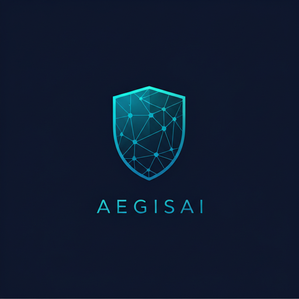
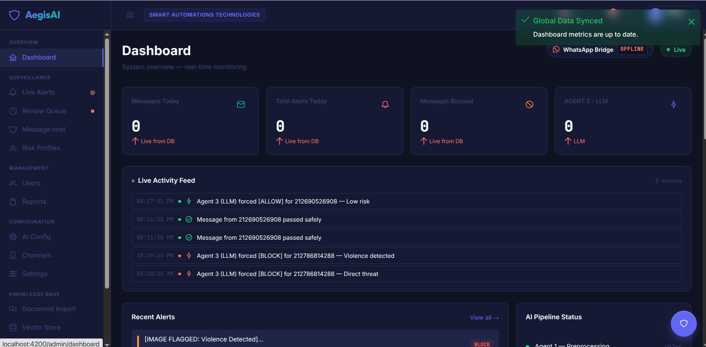
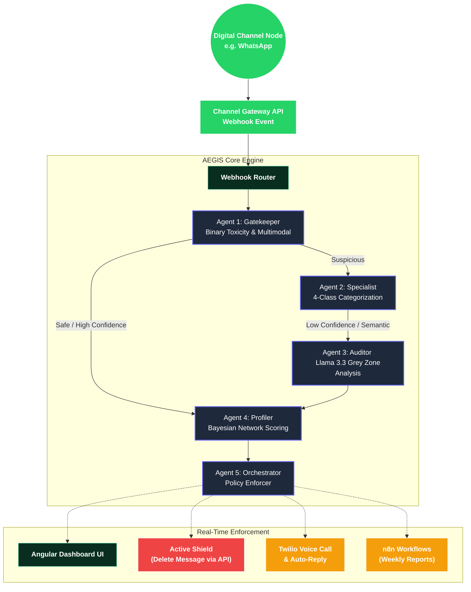

<div align="center">
  
  <h1>AEGIS AI — Automated Enforcement & Guardian Intelligence System</h1>
  <p><strong>A Real-Time Omnichannel Digital Moderation & Wellness Platform</strong></p>
  
  [](https://angular.io/)
  [](https://www.djangoproject.com/)
  [](https://www.python.org/)
  [](https://pytorch.org/)
  [](https://llama.meta.com/)
  [](https://www.trychroma.com/)
</div>

<hr>

> **AEGIS** is an intelligent, real-time cyberbullying prevention and digital wellness platform built as a *Projet de Fin d'Études (PFE)*. 
> Going beyond simple keyword filtering, AEGIS actively intercepts, analyzes, and moderates digital conversations across various messaging channels (using WhatsApp as its initial integration node), providing automated enforcement (**Active Shield**), comprehensive parental monitoring, and adult self-moderation capabilities.

Designed with a robust **5-Agent AI Architecture**, AEGIS natively supports **French**, **Arabic**, and **Darija (Moroccan Arabic)** with automatic language detection (fasttext + Darija heuristic), addressing complex regional moderation challenges while complying with Moroccan data privacy regulations (Law 09-08).

<div align="center">
  
</div>

---

## 📑 Table of Contents
- [System Architecture](#-system-architecture)
- [Multi-Agent AI Pipeline](#-multi-agent-ai-pipeline)
- [Key Features](#-key-features)
- [Performance & Optimizations](#-performance--optimizations)
- [Technology Stack](#-technology-stack)
- [Getting Started](#-getting-started)

---

## 🏗️ System Architecture

AEGIS employs an asynchronous, event-driven pipeline where specialized AI agents cooperate using the **Strategy** and **Facade** design patterns to deliver rapid, accurate moderation:



---

## 🧠 Multi-Agent AI Pipeline

1. **Agent 1 (Gatekeeper)**: An optimized BERT model that scans incoming text and a multimodal pipeline for images to detect general toxicity. Highly optimized for microsecond latency ($<50$ms).
2. **Agent 2 (Specialist)**: A secondary NLP model that categorizes harmful content into 4 threat categories (*Discrimination*, *Sexual Harassment*, *Threats*, *Verbal Harassment*), trained using **Focal Loss** to handle severe class imbalances.
3. **Agent 3 (Auditor)**: A Large Language Model (Groq Llama 3.3) invoked only for "Grey Zone" ambiguity or "Shadow Review" (auditing borderline safe texts).
4. **Agent 4 (Profiler)**: Powered by a **Bayesian Network** (10 observables, 3 risk pathways — Grooming/Bully/Troll, domain-expert CPT calibration) that updates a Digital Twin behavioral profile and assigns dynamic risk scores with archetype classification.
5. **Agent 5 (Orchestrator)**: The final decision-maker using a **Strategy Pattern** to dispatch enforcement actions across 4 paths (Standard, Child Self-Moderation, Adult Self-Moderation, Safe), managing WebSockets, WhatsApp API actions, and parent notifications.

---

## 🛡️ Key Features

* **Digital Wellness (Adult Mode)**: A non-punitive, privacy-centric monitoring mode for adults focused on digital well-being, featuring a polished Light Mode UI and tracking "Digital Fatigue" rather than enforcing strict blocks.
* **Child Self-Moderation**: When the child sends a toxic message, AEGIS deletes it and sends an educational DM via the Aegis Assistant bot, plus a constructive "Growth Moment" parent alert — turning mistakes into learning opportunities.
* **Omnichannel Moderation**: While initially integrated with WhatsApp via the Evolution API, the system architecture is channel-agnostic, capable of supporting Telegram, Discord, and other digital communication platforms.
* **Automatic Language Detection**: fasttext-based language detection (`lid.176.bin`) with a Darija heuristic, routing non-English/Arabic/French messages directly to the LLM Auditor for accurate classification.
* **Interactive RAG Chatbot**: An embedded AI assistant for parents and admins that answers legal and wellness questions using a local **ChromaDB** knowledge base, complete with **conversational memory** and a **SerpAPI Web Search fallback**.
* **Empathetic Child Chatbot**: A dedicated WhatsApp chatbot (Instance 2) that provides emotional support to children, with built-in **threat intelligence extraction** from conversational confessions.
* **Active Shield Response**: If a message is classified as `BLOCK` or `ESCALATE`, AEGIS instantly commands the messaging platform to delete the message for everyone *before* the recipient sees it.
* **Multi-Tenant Security**: Dedicated boundaries between Global Administrators and Parents, ensuring strict compliance with data privacy standards.
* **Automated Workflows**: Deep integration with **n8n** for scheduled weekly report generation and automated transcriptions.
* **Production Hardening**: Pipeline crash protection with `FailedMessage` persistence, webhook deduplication by `message_key_id`, HMAC-based webhook authentication, and a `/api/v1/health/` endpoint for monitoring.

---

## ⚡ Performance & Optimizations

To meet the rigorous demands of real-time messaging, AEGIS incorporates advanced performance strategies:
- **Focal Loss & Synthetic Data**: Training models with synthetic Moroccan Darija data injections and Focal Loss to drastically improve recall on minority classes (e.g., severe threats).
- **Semantic Caching**: Integration of a ChromaDB-backed semantic caching strategy for LLM verdicts, plus Redis-backed ML prediction caching, reducing end-to-end latency for repeated patterns.
- **Architectural Patterns**: Refactored backend utilizing the **Facade Pattern** to decouple API endpoints and the **Strategy Pattern** to cleanly manage Agent 5's enforcement actions (Standard, Child Self-Moderation, Adult Self-Moderation, Safe).
- **Pipeline Resilience**: Every pipeline invocation is wrapped in crash-safe error handling with `FailedMessage` persistence, ensuring no message is silently lost even if a model or API call fails.
- **Webhook Deduplication**: Messages are deduplicated by `message_key_id` before pipeline execution, preventing double-enforcement from Evolution API retries.

---

## 🛠️ Technology Stack

| Layer | Technologies Used |
|-------|------------------|
| **Frontend UI** | Angular 21, TypeScript, TailwindCSS, PrimeNG, Chart.js |
| **Backend API** | Django 5.2, Django REST Framework, Channels (WebSockets), Daphne (ASGI) |
| **AI Engine** | PyTorch, HuggingFace Transformers, fasttext (language detection), ViT (image classification) |
| **Knowledge Base (RAG)** | ChromaDB, LangChain, Groq Cloud API (Llama 3.3), SerpAPI |
| **External Integrations**| Evolution API v2, Twilio, n8n |
| **Data Persistence**| PostgreSQL (Core Data), Redis (Prediction Cache & WebSockets), ChromaDB (Semantic Cache) |

---

## 🚀 Getting Started

### 1. Prerequisites
- **Node.js v20+** & **Angular CLI**
- **Python 3.12+**
- **Channel API Gateway** (e.g. Evolution API for WhatsApp running locally on port `5002`)
- **PostgreSQL**, **Redis**, and **ChromaDB**

### 2. Backend Setup
The backend requires the HuggingFace `.safetensors` model weights to be placed in `aegis-backend/ml_pipeline/models/` and the fasttext language identification model (`lid.176.bin`) to be available for language detection.

```bash
cd aegis-backend
python3 -m venv venv
source venv/bin/activate
pip install -r requirements.txt

# Download fasttext language detection model (~200KB)
# Place lid.176.bin in aegis-backend/ml_pipeline/models/

cp .env.example .env
# Open .env and insert your GROQ_API_KEY, EVOLUTION_API_KEY, SERPAPI_KEY, and DB URLs.

python manage.py migrate
python manage.py runserver
```

### 3. Frontend Setup
```bash
cd aegis-frontend
npm install
ng serve
```

Access the dashboard at `http://localhost:4200`.

---

<div align="center">
  <p>Built with ❤️ by <b>Mohamed ZNITA</b> — PFE Student</p>
</div>
